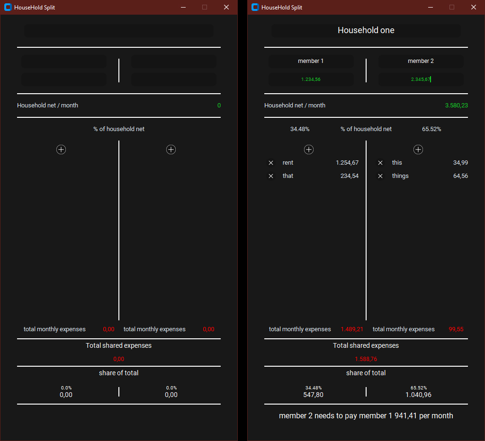
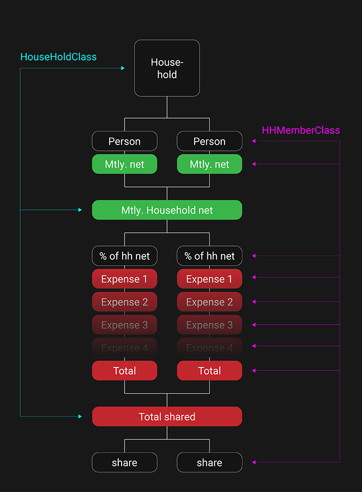
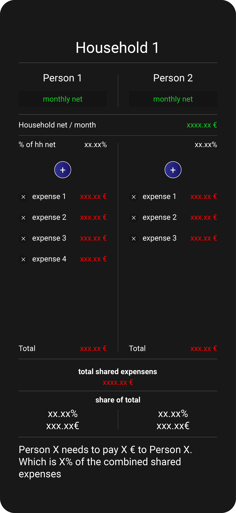

# HouseholdSplit
A simple app to split recurring household expenses percentage-wise.

---

## Background

This project is primarily for educational purposes. I aimed to improve my understanding of object-oriented programming, experiment with dictionaries, and gain experience working with databases.  Everything this does you could do with a simple excel spreadsheet, which is what I was doing before creating this.

## Features

•	Adding two household members and their net income 
•	Adding expenses for each household member 
•	Displaying the exact amount to be paid at the bottom 
•	Storing all data in a household_database.db 

## How to Use

To start, simply run the executable and begin entering information at the top. The entry fields will activate sequentially in the correct order (household name first, then the first member's name, etc.). 
Once all necessary information is provided, the calculated result will appear at the bottom. Additionally, you can view the percentage values used for transparency. 
The database file is created upon startup in the same directory as the .exe. Whenever changes are made (household name, member names/incomes, added or removed expenses), the database is updated. To start completely from scratch, delete the .db file, and all entries will be removed.

As shown above, this is the initial design and functionality I envisioned for the project. While I believe I got pretty close with tkinter, it's time to explore alternative UI frameworks. Although the current implementation is functional and meets my goals, I would probably approach it differently if starting over. After all the goal was to learn and I learned a lot. :)